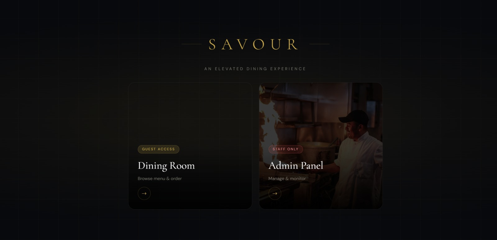
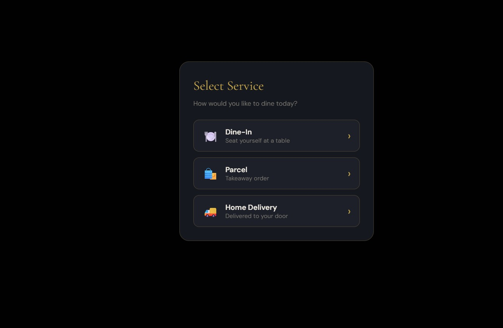
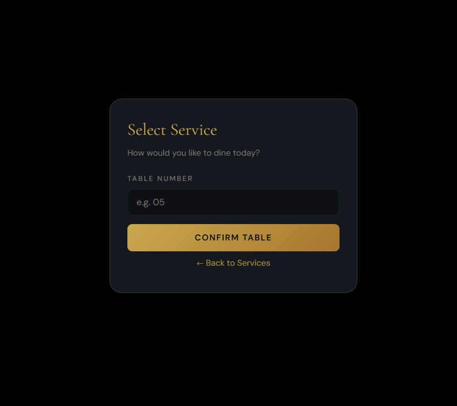
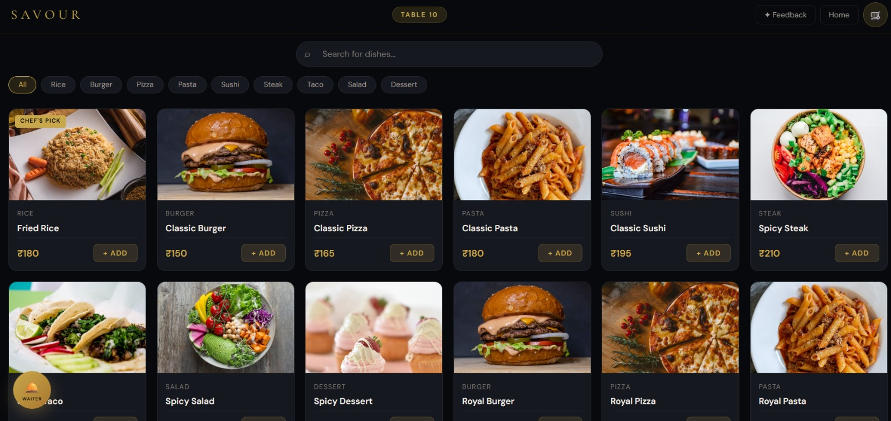
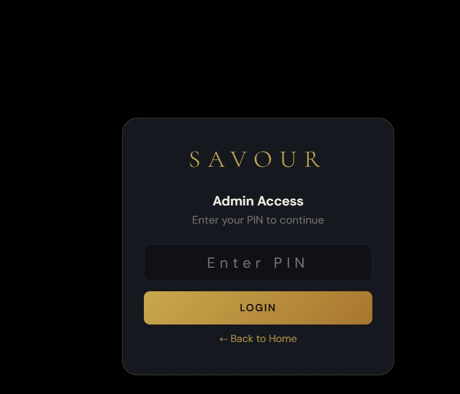
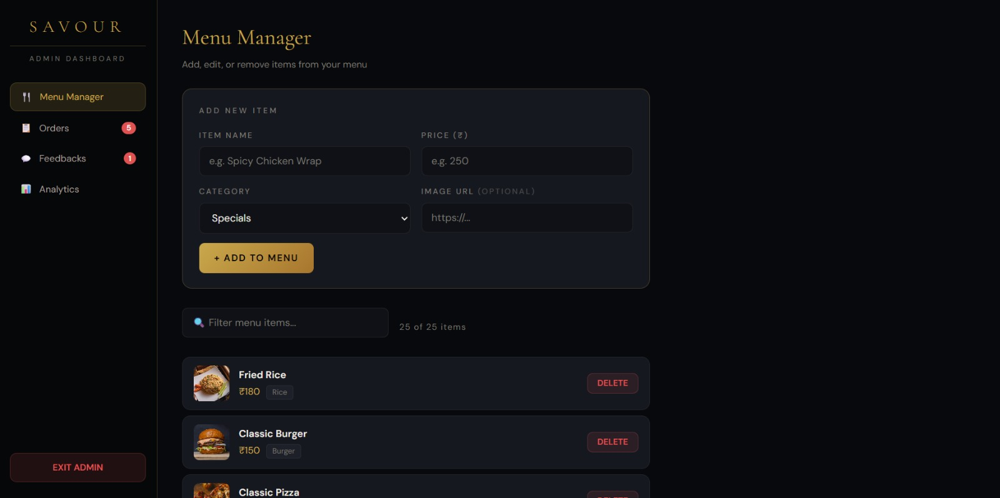

Option 2: Add Screenshots

Yes, adding screenshots is a good idea.

Create a folder called screenshots and upload:

Home page
Menu page
Order section
Any special feature

Then add them to your README.

Example:

# Savours Smart Restaurant Management System

## Screenshots

